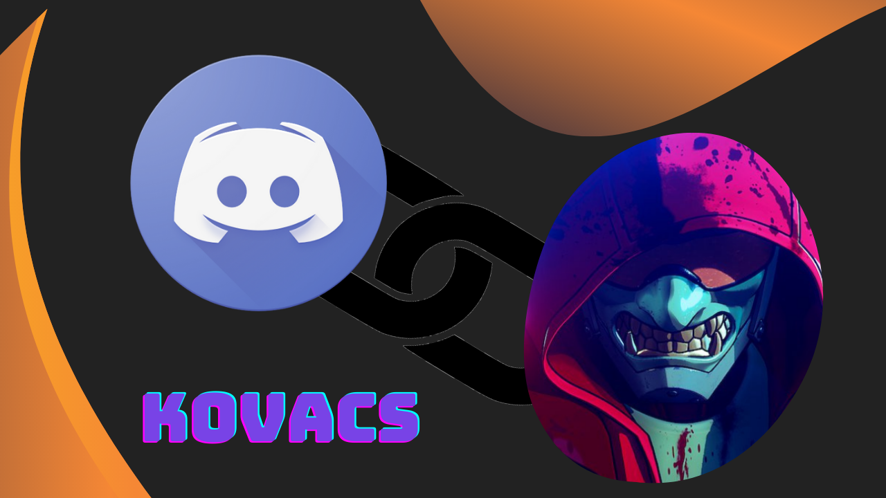

  
  
  
  

# Kovacs Discord Bot

 
 

## Discord Support

<h2> • Info</h2>

Kovacs is a multipurpose Discord bot that was designed to make your Discord life easier and cooler. It is also an open source project which other developers can contribute to and work on it together.

<h2> • Features</h2>
<ul>
  <li>🟢 Low latency, super fast response time.</li>
  <li>📨 Autoposting (automeme, autowaifu, etc...)</li>
  <li>📈 Creative Economy System</li>
  <li>🐕 Cute Images(dog , cat ,fox ....)</li>
  <li>🎮 Games like RockPaperScissors,Guess the Word , Hangman and more comming soon</li>

  <li>🌍 Global chat.</li>
  <li>🔨 Powerful moderation, with kick, ban and unban.</li>
  <li>☺️ Lots and lots of fun commands and image commands.</li>
  <li>🎀 Regularly updated and maintained.</li>
</ul>

<h2> • How can I contribute?</h2>

You may help by adding features to Kovacs or fix bugs in the code. Here's how:

<ol>
  <li>Fork the repository</li>
  <li>Clone your fork: <code>git clone https://github.com/your-username/kovacs-discord-bot.git</code></li>
  <li>Create your feature branch: <code>git checkout -b my-new-feature</code></li>
  <li>Commit your changes: <code>git commit -am 'new feature'</code></li>
  <li>Push to the branch: <code>git push origin my-new-feature</code></li>
  <li>Submit a pull request</li>
</ol>

<h2> • How to selfhost Kovacs?</h2>

Be sure to follow the [license](https://github.com/Envoy-VC/kovacs-discord-bot/blob/master/LICENSE)  
 
Here are the steps that you can follow to sefhost Kovacs - https://github.com/Envoy-VC/kovacs-selfhost-guide

<h4><b>Note:</b> We do not provide support for self-hosting. If you are unable to self host Kovacs by yourself, just contact me.</h4>

<h2> • Self-hosting Agreement</h2>

- You must not use Kovacs's name, license, or logo in your works.
- You must follow the license as stated [here](https://github.com/Envoy-VC/kovacs-discord-bot/blob/master/LICENSE).
- Provide full credits to both CONTRIBUTORS and the original creator.